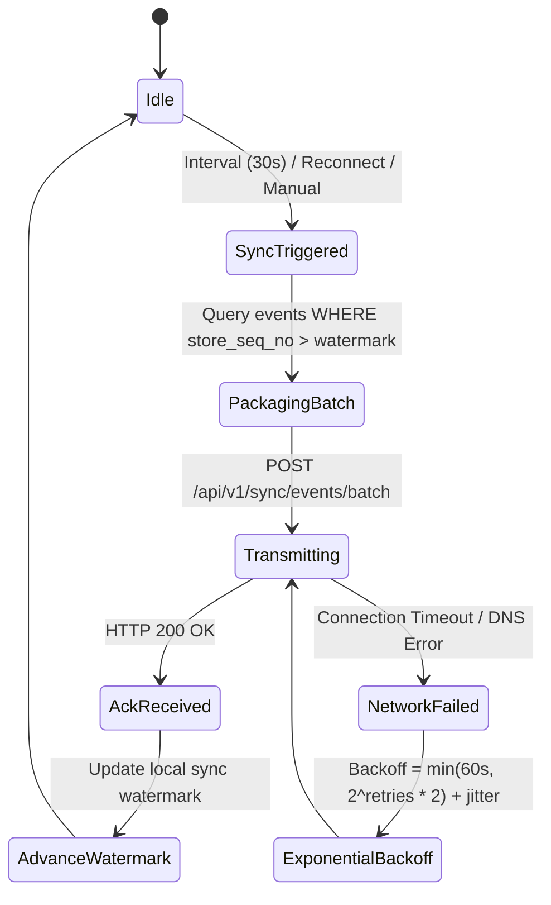
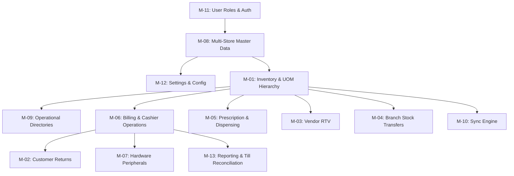

# Pharmacy POS — Routed Architectural Detail (`ROUTED-DETAIL.md`)

This document captures all detailed specifications, code blocks, payload structures, testing suites, and scenario matrices moved out of `architecture_v1_6_5.md` during the Architecture Doc Compression Pass. 

This content is strictly partitioned by destination document (Docs 1–11) to directly seed the authoring of the modular documentation suite.

---

## Historical Version Archive: v1.6.5 Changelog Detail

*(Removed from header of architecture spec per discipline rule: "Collapse version history to one line per version, max 15 words")*

1. **Fractional Inventory & Unit of Measure (UOM) Hierarchy (§3, §6)**: Stores and calculates batch inventory exclusively in atomic integer Base Dispensing Units (tablets, capsules, ml). Batch-level immutability for pack_size, packaging_unit, and base_unit prevents central catalog edits from distorting on-shelf stock counts. Legal Metrology Rule 2011 fractional rounding with statutory MRP price clamping. Scanning 1D/2D barcodes strictly defaults to 1 Packaging Unit (pack_size base units). Sealed blister cavities return to active inventory; cut/punctured cavities route to quarantine-write-off.
2. **Near-Expiry Vendor Returns (RTV) & Local Supplier Debit Notes (§5, §6, §8)**: Configurable shelf-expiry alert tiers (90d Amber FEFO / 60d Orange RTV packing / 30d Red shelf quarantine). Added stock-move: rtv-quarantine event. Introduced sequential, offline GST Debit Notes (<STORE_CODE>-DN-YYYYMM-XXXX) with CGST/SGST/IGST tax reversal breakdowns. Replicated distributor profiles for offline document generation.
3. **Rule 55 Inter-Store Statutory Delivery Challans (§5, §6, §8)**: Offline sequential Delivery Challans (<STORE_CODE>-DC-YYYYMM-XXXX) for physical branch road transport. Statutory guard mandates identical GSTIN and state codes; automatically blocks Challan and requires an IGST Stock Transfer Invoice for inter-state movements. Receipt discrepancy ingestion in transfer-receive splits into received_qty (intact), transit_breakage_qty (quarantine write-off with photo audit), and transit_shortage_qty (shrinkage investigation flag).
4. **Schedule X & NDPS Dual-Prescription Custody & Bound Ledger (§3, §5, §10)**: Mandatory digital scanning/photo capture of duplicate prescriptions (compressed to <250 KB WebP, AES-256 encrypted, 90-day edge retention with 2-year cloud archive). Dispense events capture registered Pharmacist PIN and State Pharmacy Council credentials. Automated, immutable Daily Running Balance Ledger (Opening + Receipts - Dispensed = Closing). One-click State Drug Licensing Authority statutory export.
5. **In-Store Multi-Counter LAN Topology & Failover Fencing (§2, §4)**: Counter 1 (Primary Node) runs authoritative Postgres on 127.0.0.1 and Store FastAPI on LAN (0.0.0.0:8000). Counter 2/3 (Worker Terminals) run lightweight UI connecting over LAN via mDNS (medpos-primary.local:8000) for dynamic DHCP router immunity. Single sequence authority maintains monotonic store_seq_no and gapless invoice series. Standby failover script (promote_to_primary.bat) enforces LAN reachability fencing and applies emergency sequence epoch (<STORE_CODE>-INV-YYYYMM-XXXX-F1) on total hardware loss.
6. **Central Batch Ingestion Push Atomicity & Poison-Pill Quarantine (§5)**: Wraps Central event batch ingestion and sequence watermark updates in a single atomic database transaction (BEGIN...COMMIT). Malformed/schema-violating events route to central_sync_quarantine with sync-quarantine-tombstone records in central_events to preserve sequence continuity without wedging the store retry queue.
7. **Thermal Receipt Printer Jam Resilience & Abandonment Accounting (§3, §4, §8, Hardware)**: Two-phase checkout commit (COMMITTED_PENDING_PRINT -> COMPLETED). Non-blocking 300ms ESC/POS status check with automatic OS print spooler fallback for write-only USB printers. Cash drawer kick synchronized with print spooling. Prominent UI error banner with one-click reprint and audited *** DUPLICATE COPY *** watermark. If customer leaves during a jam, cashier triggers an automated void issuing an offsetting GST Credit Note (<STORE_CODE>-CN-...), preserving gapless numbering.
8. **Windows OS Edge Security Hardening (§16)**: OS file permissions locked via icacls restricting AES-256 database keys and environment files strictly to NT SERVICE\MedPOS.
9. **Pragmatic Interim Enterprise Bridges (§3, §8, §9, §18)**: Sequential Store-Local B2B Invoices (<STORE_CODE>-B2B-YYYYMM-XXXX) under Rule 46(b) for manual monthly GSTR-1 upload; dynamic NPCI UPI QR string on 80mm thermal receipts (upi://pay?...); cashier one-click WhatsApp Web share link (wa.me); manual Insurance/TPA tender metadata fields.

---

## Doc 1: Data Schema Doc

### 1.1 Central Sync & Quarantine Table Schemas
```sql
-- Central sync event log
CREATE TABLE central_events (
    event_id UUID PRIMARY KEY,
    store_seq_no BIGINT NOT NULL,
    store_id VARCHAR(32) NOT NULL,
    created_at TIMESTAMP WITH TIME ZONE NOT NULL,
    event_type VARCHAR(64) NOT NULL,
    payload JSONB NOT NULL,
    ingested_at TIMESTAMP WITH TIME ZONE DEFAULT CURRENT_TIMESTAMP,
    CONSTRAINT uq_store_event_seq UNIQUE (store_id, store_seq_no)
);

-- Store sequence watermarks
CREATE TABLE store_sync_watermarks (
    store_id VARCHAR(32) PRIMARY KEY,
    last_committed_seq BIGINT NOT NULL DEFAULT 0,
    updated_at TIMESTAMP WITH TIME ZONE DEFAULT CURRENT_TIMESTAMP
);

-- Central poison-pill quarantine table
CREATE TABLE central_sync_quarantine (
    quarantine_id UUID PRIMARY KEY DEFAULT gen_random_uuid(),
    event_id UUID NOT NULL,
    store_id VARCHAR(32) NOT NULL,
    store_seq_no BIGINT NOT NULL,
    raw_payload JSONB NOT NULL,
    quarantine_reason TEXT NOT NULL,
    quarantined_at TIMESTAMP WITH TIME ZONE DEFAULT CURRENT_TIMESTAMP,
    resolved BOOLEAN NOT NULL DEFAULT FALSE,
    resolution_notes TEXT NULL
);
```

### 1.2 Batch Table UOM Field Schema & Constraints
```sql
-- Batch level immutability schema
ALTER TABLE batches ADD COLUMN packaging_unit VARCHAR(32) NOT NULL; -- e.g., 'Strip of 10', 'Bottle of 60ml'
ALTER TABLE batches ADD COLUMN base_unit VARCHAR(16) NOT NULL;      -- e.g., 'tablet', 'capsule', 'ml'
ALTER TABLE batches ADD COLUMN pack_size INTEGER NOT NULL CHECK (pack_size > 0);
ALTER TABLE batches ADD COLUMN strip_mrp NUMERIC(10,2) NOT NULL CHECK (strip_mrp > 0);
ALTER TABLE batches ADD COLUMN base_unit_mrp NUMERIC(10,4) NOT NULL; -- computed half-up (strip_mrp / pack_size)

-- Batch stock balance stored strictly as integer base dispensing units
ALTER TABLE batch_stock ADD COLUMN current_base_qty INTEGER NOT NULL DEFAULT 0 CHECK (current_base_qty >= 0);
```

### 1.3 Document Series Table Schemas & GST Line-Item Fields
```sql
-- Sequential document trackers
CREATE TABLE store_document_sequences (
    store_id VARCHAR(32) NOT NULL,
    doc_type VARCHAR(16) NOT NULL, -- 'INV', 'INV-F1', 'B2B', 'CN', 'DN', 'DC'
    year_month CHAR(6) NOT NULL,    -- 'YYYYMM'
    last_seq_no INTEGER NOT NULL DEFAULT 0,
    PRIMARY KEY (store_id, doc_type, year_month)
);

-- GST Invoices (B2C and B2B)
CREATE TABLE invoices (
    invoice_id UUID PRIMARY KEY,
    invoice_number VARCHAR(64) UNIQUE NOT NULL, -- <STORE_CODE>-INV-YYYYMM-XXXX
    store_id VARCHAR(32) NOT NULL,
    invoice_type VARCHAR(16) NOT NULL,          -- 'B2C', 'B2B'
    customer_id UUID NULL,
    buyer_gstin VARCHAR(15) NULL,
    buyer_legal_name VARCHAR(128) NULL,
    gross_amount NUMERIC(10,2) NOT NULL,
    total_cgst NUMERIC(10,2) NOT NULL,
    total_sgst NUMERIC(10,2) NOT NULL,
    total_igst NUMERIC(10,2) NOT NULL DEFAULT 0.00,
    total_discount NUMERIC(10,2) NOT NULL DEFAULT 0.00,
    net_amount NUMERIC(10,2) NOT NULL,
    payment_status VARCHAR(16) NOT NULL,
    print_status VARCHAR(32) NOT NULL DEFAULT 'COMMITTED_PENDING_PRINT',
    created_at TIMESTAMP WITH TIME ZONE NOT NULL
);

-- GST Invoice Line Items
CREATE TABLE invoice_line_items (
    line_item_id UUID PRIMARY KEY,
    invoice_id UUID NOT NULL REFERENCES invoices(invoice_id),
    drug_id UUID NOT NULL,
    batch_id UUID NOT NULL,
    hsn_code VARCHAR(8) NOT NULL,
    pack_qty INTEGER NOT NULL DEFAULT 0,
    loose_qty INTEGER NOT NULL DEFAULT 0,
    billed_base_qty INTEGER NOT NULL,          -- (pack_qty * pack_size) + loose_qty
    unit_price NUMERIC(10,2) NOT NULL,
    subtotal NUMERIC(10,2) NOT NULL,
    cgst_rate NUMERIC(5,2) NOT NULL,
    sgst_rate NUMERIC(5,2) NOT NULL,
    igst_rate NUMERIC(5,2) NOT NULL DEFAULT 0.00,
    cgst_amount NUMERIC(10,2) NOT NULL,
    sgst_amount NUMERIC(10,2) NOT NULL,
    igst_amount NUMERIC(10,2) NOT NULL DEFAULT 0.00,
    total_line_amount NUMERIC(10,2) NOT NULL
);
```

### 1.4 Discount Preset Table & TPA Metadata Schema
```sql
CREATE TABLE discount_presets (
    preset_id UUID PRIMARY KEY,
    name VARCHAR(64) NOT NULL,
    discount_percentage NUMERIC(5,2) NOT NULL CHECK (discount_percentage >= 0 AND discount_percentage <= 100),
    applies_to VARCHAR(16) NOT NULL, -- 'CATEGORY', 'ITEM', 'ALL'
    category_id UUID NULL,
    drug_id UUID NULL,
    version INTEGER NOT NULL DEFAULT 1,
    is_active BOOLEAN NOT NULL DEFAULT TRUE,
    updated_at TIMESTAMP WITH TIME ZONE NOT NULL
);

-- TPA / Insurance tender metadata captured on invoices
CREATE TABLE invoice_tpa_metadata (
    invoice_id UUID PRIMARY KEY REFERENCES invoices(invoice_id),
    insurer_name VARCHAR(128) NOT NULL,
    policy_number VARCHAR(64) NOT NULL,
    approval_code VARCHAR(64) NOT NULL,
    claim_amount NUMERIC(10,2) NOT NULL,
    recorded_at TIMESTAMP WITH TIME ZONE DEFAULT CURRENT_TIMESTAMP
);
```

### 1.5 Schedule H1 Register & Schedule X Ledger Table Schemas
```sql
CREATE TABLE schedule_h1_register (
    register_id UUID PRIMARY KEY,
    dispense_id UUID NOT NULL,
    store_id VARCHAR(32) NOT NULL,
    supply_date_time TIMESTAMP WITH TIME ZONE NOT NULL,
    patient_name VARCHAR(128) NOT NULL,
    patient_address TEXT NOT NULL,
    doctor_name VARCHAR(128) NOT NULL,
    doctor_address TEXT NOT NULL,
    doctor_council_reg_no VARCHAR(64) NOT NULL,
    drug_generic_name VARCHAR(128) NOT NULL,
    drug_brand_name VARCHAR(128) NOT NULL,
    batch_number VARCHAR(32) NOT NULL,
    manufacturer_name VARCHAR(128) NOT NULL,
    quantity_dispensed_base INTEGER NOT NULL,
    pack_size INTEGER NOT NULL,
    pharmacist_id UUID NOT NULL,
    pharmacist_reg_no VARCHAR(64) NOT NULL
);

CREATE TABLE schedule_x_running_ledger (
    ledger_entry_id UUID PRIMARY KEY,
    store_id VARCHAR(32) NOT NULL,
    batch_id UUID NOT NULL,
    entry_date DATE NOT NULL,
    opening_base_balance INTEGER NOT NULL,
    receipts_base_qty INTEGER NOT NULL DEFAULT 0,
    dispensed_base_qty INTEGER NOT NULL DEFAULT 0,
    closing_base_balance INTEGER NOT NULL,
    prescription_image_path TEXT NOT NULL,
    prescription_image_hash VARCHAR(64) NOT NULL,
    pharmacist_password_verified BOOLEAN NOT NULL DEFAULT TRUE,
    pharmacist_council_reg_no VARCHAR(64) NOT NULL,
    created_at TIMESTAMP WITH TIME ZONE DEFAULT CURRENT_TIMESTAMP,
    CONSTRAINT uq_batch_ledger_date UNIQUE (store_id, batch_id, entry_date)
);
```

### 1.6 Shift Session & Z-Report Table Schemas
```sql
CREATE TABLE cashier_shifts (
    shift_id UUID PRIMARY KEY,
    store_id VARCHAR(32) NOT NULL,
    terminal_id VARCHAR(16) NOT NULL,
    cashier_id UUID NOT NULL,
    opened_at TIMESTAMP WITH TIME ZONE NOT NULL,
    opening_cash_float NUMERIC(10,2) NOT NULL,
    closed_at TIMESTAMP WITH TIME ZONE NULL,
    closing_type VARCHAR(16) NULL,           -- 'NORMAL', 'FORCE_CLOSE'
    closed_by UUID NULL,
    declared_physical_cash NUMERIC(10,2) NULL,
    calculated_system_cash NUMERIC(10,2) NULL,
    cash_variance NUMERIC(10,2) NULL,
    total_card_sales NUMERIC(10,2) NULL,
    total_upi_sales NUMERIC(10,2) NULL,
    total_credit_notes_issued NUMERIC(10,2) NULL,
    total_credit_notes_redeemed NUMERIC(10,2) NULL,
    supervisor_notes TEXT NULL
);

CREATE TABLE day_end_z_reports (
    report_id UUID PRIMARY KEY,
    store_id VARCHAR(32) NOT NULL,
    report_date DATE NOT NULL,
    generated_at TIMESTAMP WITH TIME ZONE NOT NULL,
    generated_by UUID NOT NULL,
    gross_sales NUMERIC(12,2) NOT NULL,
    net_sales NUMERIC(12,2) NOT NULL,
    total_tax_collected NUMERIC(12,2) NOT NULL,
    tender_breakdown JSONB NOT NULL,
    returns_summary JSONB NOT NULL,
    debit_notes_summary JSONB NOT NULL,
    shift_variances_summary JSONB NOT NULL,
    z_sequence_no INTEGER NOT NULL,
    CONSTRAINT uq_store_z_date UNIQUE (store_id, report_date)
);
```

---

## Doc 2: Event Schema Doc

### 2.1 Full Event Payload Schemas for Events 1–20 & Tombstones
Every event payload adheres to JSONB structured typing:
1. `sale`: `{ "invoice_number": "<STORE_CODE>-INV-YYYYMM-XXXX", "customer_id": "UUID|null", "lines": [{ "drug_id": "UUID", "batch_id": "UUID", "pack_qty": 2, "loose_qty": 5, "base_qty": 25, "unit_price": 1.43, "line_total": 35.75, "cgst": 2.14, "sgst": 2.14 }], "payment": { "method": "CASH|CARD|UPI|SPLIT", "details": {} } }`
2. `b2b-sale`: `{ "invoice_number": "<STORE_CODE>-B2B-YYYYMM-XXXX", "buyer_gstin": "29AAAAA0000A1Z5", "buyer_name": "ABC Pharmacy Pvt Ltd", "lines": [...], "taxes": { "cgst": 100, "sgst": 100, "igst": 0 } }`
3. `sale-return`: `{ "credit_note_number": "<STORE_CODE>-CN-YYYYMM-XXXX", "original_invoice_number": "<STORE_CODE>-INV-...", "reason": "WRONG_MEDICATION|EXCESS", "items": [{ "drug_id": "UUID", "batch_id": "UUID", "returned_base_qty": 10, "condition": "SEALED_INTACT|PUNCTURED_CONTAMINATED", "destination": "active-inventory|quarantine-write-off", "refund_amount": 14.30 }] }`
4. `dispense`: `{ "prescription_id": "UUID", "patient_id": "<STORE_CODE>-PAT-UUID", "prescriber_id": "<STORE_CODE>-DOC-UUID", "is_schedule_h1": true, "is_schedule_x": false, "h1_payload": { "doctor_reg_no": "KMC-45920", "doctor_address": "Gupta Polyclinic, Bangalore", "patient_address": "123 Indiranagar, Bangalore", "drug_generic_name": "Amoxicillin + Clavulanate", "brand_name": "Augmentin 625 Duo", "batch_no": "AUG2026-01", "mfg_name": "GSK India", "dispensed_qty_base": 10, "pack_size": 10, "pharmacist_id": "UUID", "pharmacist_reg_no": "KPC-78219" }, "schedule_x_payload": { "duplicate_prescription_scanned": true, "prescription_image_hash": "e3b0c44298fc1c149afbf4c8996fb92427ae41e4649b934ca495991b7852b855", "dispensed_qty_base": 10, "running_balance_after": 40, "pharmacist_password_verified": true, "pharmacist_reg_no": "KPC-78219" } }`
5. `stock-move`: `{ "reason": "transfer-dispatch|transfer-receive|rtv-quarantine|write-off|adjustment-in", "reference_doc": "<STORE_CODE>-DC-...|<STORE_CODE>-DN-...", "lines": [{ "batch_id": "UUID", "base_qty": 50, "discrepancy_breakdown": { "received": 45, "breakage": 3, "shortage": 2 } }] }`
6. `shift-open`: `{ "terminal_id": "POS-01", "cashier_id": "UUID", "cashier_name": "John Doe", "opening_cash_float": 1000.00, "shift_epoch": 1 }`
7. `shift-close`: `{ "terminal_id": "POS-01", "cashier_id": "UUID", "declared_physical_cash": 14250.00, "system_cash": 14250.00, "variance": 0.00, "tender_totals": { "upi": 3400.00, "card": 5600.00 } }`
8. `shift-force-close`: `{ "terminal_id": "POS-01", "abandoned_cashier_id": "UUID", "authorized_manager_id": "UUID", "reason": "CASHIER_EMERGENCY_LEAVE", "manager_cash_count": 12000.00 }`
9. `patient-created`: `{ "patient_id": "<STORE_CODE>-PAT-UUID", "name": "Anita Roy", "phone": "9876543210", "address": "123 Indiranagar, Bangalore" }`
10. `doctor-created`: `{ "doctor_id": "<STORE_CODE>-DOC-UUID", "name": "Dr. S. K. Gupta", "reg_no": "KMC-45920", "clinic_address": "Gupta Polyclinic, Bangalore" }`
11. `discount-edit`: `{ "preset_id": "UUID", "field": "discount_percentage", "old_value": 10.0, "new_value": 12.5, "authorized_by": "UUID", "version": 4 }`
12. `master-data-edit`: `{ "table": "catalog_items", "record_id": "UUID", "field_name": "hsn_code", "current_value": "30049099", "proposed_value": "30041010", "expected_version": 2 }`
13. `master-data-created`: `{ "table": "catalog_items", "business_key": "8901234567890", "initial_payload": { "brand_name": "Augmentin 625 Duo", "generic_name": "Amoxicillin and Potassium Clavulanate", "hsn_code": "30041010", "gst_rate": 12.00, "drug_schedule": "H1", "is_ndps": false, "pack_size": 10, "packaging_unit": "Strip of 10", "base_unit": "tablet", "mrp": 204.50 }, "version": 1 }`
14. `master-data-change-requested`: `{ "request_id": "UUID", "manager_id": "UUID", "scope": { "field": "mrp", "old": 120, "new": 135 }, "expected_version": 3 }`
15. `master-data-change-approved`: `{ "request_id": "UUID", "decided_by": "UUID", "status": "APPROVED" }`
16. `master-data-change-rejected`: `{ "request_id": "UUID", "decided_by": "UUID", "status": "REJECTED", "rejection_reason": "stale|duplicate|stock-remaining|manual" }`
17. `low-stock-alert`: `{ "item_id": "UUID", "store_id": "STORE-01", "current_stock_base": 14, "threshold_base": 20 }`
18. `settings-change`: `{ "setting_key": "compliance_mode", "old_value": "MANDATORY", "new_value": "OPTIONAL", "changed_by": "UUID" }`
19. `grn`: `{ "grn_number": "<STORE_CODE>-GRN-YYYYMM-XXXX", "distributor_id": "UUID", "purchase_invoice_no": "INV-2026-8812", "purchase_invoice_date": "2026-09-20", "received_at": "2026-09-22T10:00:00Z", "received_by": "UUID", "lines": [{ "drug_id": "UUID", "batch_no": "BCH-9921", "expiry_date": "2028-09-30", "mrp": 120.00, "purchase_price_per_unit": 85.50, "ordered_pack_qty": 10, "received_pack_qty": 10, "pack_size": 10, "base_qty": 100, "hsn_code": "30041010", "cgst_rate": 6.0, "sgst_rate": 6.0 }] }`
20. `credit-note-redemption`: `{ "redemption_id": "UUID", "credit_note_number": "<STORE_CODE>-CN-YYYYMM-XXXX", "redeemed_invoice_number": "<STORE_CODE>-INV-YYYYMM-XXXX", "customer_id": "UUID|null", "redeemed_amount": 250.00, "remaining_credit_balance": 150.00, "authorized_by": "UUID" }`
- `sync-quarantine-tombstone`: `{ "quarantined_event_id": "UUID", "original_event_type": "sale", "error_code": "SCHEMA_VIOLATION", "quarantine_timestamp": "2026-09-19T23:36:00Z" }`

### 2.2 Atomic Central Batch Ingestion SQL Flow
```sql
BEGIN;
  -- 1. Deduplicated batch insert
  INSERT INTO central_events (event_id, store_seq_no, store_id, created_at, event_type, payload)
  VALUES (:event_id, :store_seq_no, :store_id, :created_at, :event_type, :payload)
  ON CONFLICT (event_id) DO NOTHING;

  -- 2. Watermark progress commit
  UPDATE store_sync_watermarks 
  SET last_committed_seq = :max_batch_seq, updated_at = CURRENT_TIMESTAMP 
  WHERE store_id = :store_id AND last_committed_seq < :max_batch_seq;
COMMIT;
```

---

## Doc 3: API Contract Doc

### 3.1 Central Sync Ingestion Endpoint Contract
- **Endpoint**: `POST /api/v1/sync/events/batch`
- **Caller**: Store Primary Node (Counter 1 Sync Service).
- **Authentication**: Store Mutual TLS / Bearer Store Gateway Token.
- **Request Headers**:
  - `X-Store-ID`: `STORE-01`
  - `Content-Type`: `application/json`
- **Request Schema**:
  ```json
  {
    "store_id": "STORE-01",
    "batch_size": 50,
    "events": [
      {
        "event_id": "3fa85f64-5717-4562-b3fc-2c963f66afa6",
        "store_seq_no": 1042,
        "store_id": "STORE-01",
        "created_at": "2026-09-19T18:00:00.000Z",
        "event_type": "sale",
        "payload": {
          "invoice_number": "STORE-01-INV-202609-0042",
          "net_amount": 1050.00,
          "lines": [{"drug_id": "UUID", "batch_no": "BCH-01", "qty": 10}]
        }
      }
    ]
  }
  ```
- **Response Schema (200 OK)**:
  ```json
  {
    "status": "success",
    "acknowledged_seq": 1042,
    "quarantined_events": [
      "550e8400-e29b-41d4-a716-446655440000"
    ],
    "downstream_master_data": {
      "catalog_updates": [],
      "governance_decisions": []
    }
  }
  ```
- **Error Codes**:
  - `400 BAD_REQUEST`: Malformed envelope structure.
  - `401 UNAUTHORIZED`: Invalid store certificate or expired token.
  - `409 SEQUENCE_GAP`: Store sequence dropped a number.

### 3.2 Central Admin Web Portal Endpoints
- `GET /api/v1/admin/governance/requests` — View pending master-data change requests.
- `POST /api/v1/admin/governance/requests/{id}/approve` — Approve change request with version increment.
- `POST /api/v1/admin/governance/requests/{id}/reject` — Reject change request with reason code.
- `GET /api/v1/admin/reports/shrinkage` — Multi-store aggregate shrinkage and in-line stock adjustment reports.

---

## Doc 4: RBAC Permission Matrix

### Comprehensive Action-by-Role Grid
| Action / Capability | Pharmacist | Cashier | Manager | Admin | High-Access (Simple) | Low-Access (Simple) |
|---|:---:|:---:|:---:|:---:|:---:|:---:|
| Front-Desk Checkout (B2C/B2B) | No | **Yes** | **Yes** | **Yes** | **Yes** | **Yes** |
| Apply Configured Discount Presets | No | **Yes** | **Yes** | **Yes** | **Yes** | **Yes** |
| Open / Close Own Shift Float | No | **Yes** | **Yes** | **Yes** | **Yes** | **Yes** |
| Dispense General Drugs | **Yes** | No | **Yes** | **Yes** | **Yes** | No |
| Dispense Schedule H1 / X Drugs | **Yes** | Blocked | **Yes** | **Yes** | **Yes** | Blocked |
| Prescription Digital Capture | **Yes** | No | **Yes** | **Yes** | **Yes** | No |
| Authorize Customer Sales Return | No | No | **Yes** | **Yes** | **Yes** | No |
| Issue Vendor RTV Debit Note | No | No | **Yes** | **Yes** | **Yes** | No |
| Rule 55 Delivery Challan Dispatch/Receive | No | No | **Yes** | **Yes** | **Yes** | No |
| Authorize POS In-line `adjustment-in` | No | No | **Yes** | **Yes** | **Yes** | No |
| Force-Close Abandoned Cashier Shift | No | No | **Yes** | **Yes** | **Yes** | No |
| Disable Compromised Local User Account | No | No | **Yes** | **Yes** | **Yes** | No |
| Direct Edit Discount Presets (Live) | No | No | **Yes** | **Yes** | **Yes** | No |
| Submit Master-Data Change Request | No | No | **Yes** | **Yes** | **Yes** | No |
| Direct Master-Data Edit/Create/Delete | No | No | No | **Yes** | **Yes** | No |
| Approve/Reject Governance Requests | No | No | No | **Yes** | **Yes** | No |
| Configure Compliance Mode | No | No | No | **Yes** | **Yes** | No |

---

## Doc 5: Critical Flow State Machines

### 5.1 Standby Failover Script Steps & Fencing State Machine
Script: `promote_to_primary.bat` on Counter 2:
1. **Step 1 (LAN Fencing Check)**: 
   - Script attempts HTTP GET `http://192.168.1.10:8000/health` and ICMP ping against Counter 1.
   - If Counter 1 returns 200 OK or responds to ping, promotion aborts immediately with error: `SPLIT_BRAIN_HAZARD_ABORT`.
2. **Step 2 (Local Service Activation)**:
   - Starts Windows service `postgresql-x64-16` on Counter 2.
   - Executes `pg_ctl promote` to take local database out of WAL standby mode.
   - Starts `medpos-fastapi` Windows service.
3. **Step 3 (Emergency Sequence Epoch Shift)**:
   - Sets local document configuration parameter: `ACTIVE_INVOICE_EPOCH = '<STORE_CODE>-INV-YYYYMM-XXXX-F1'`.
   - Executes SQL: `SELECT setval('store_seq_no_seq', (SELECT MAX(store_seq_no) + 100000 FROM events));`.

### 5.2 Outbound Sync Retry & Backoff State Machine


### 5.3 Batch Picking & Fractional Return Inspection
- **Picking Priority**:
  1. GS1 DataMatrix 2D Barcode scanned -> Explicit Batch override.
  2. Manual search -> FEFO suggestion (earliest expiring batch with `current_base_qty > 0`).
  3. Multi-batch splitting triggered automatically if requested quantity > selected batch stock.
- **Return Inspection Routing**:
  - Unopened blister strip / intact airtight foil cavities -> Restock to `active-inventory`.
  - Torn foil, punctured cavities, cut blister strip without seal -> Route to `quarantine-write-off`.
  - Cold-chain medication (insulin/vaccines) -> Mandatory route to `quarantine-write-off`.
  - Batch expired since purchase -> Mandatory route to `quarantine-write-off`.

### 5.4 Two-Phase Checkout Print Commit & Abandonment Void Workflow
1. Cashier clicks "Tender & Bill".
2. Transaction commits locally in Postgres: `invoices.print_status = 'COMMITTED_PENDING_PRINT'`.
3. POS queries thermal printer via ESC/POS (`ESC v` / non-blocking status check, 300ms timeout).
4. If printer ready:
   - Spools ESC/POS byte stream.
   - Triggers drawer kick pulse (`ESC p 0 25 250`) via RJ11.
   - Updates status: `invoices.print_status = 'COMPLETED'`.
5. If printer paper jam or offline:
   - Spooler fallback active. UI triggers red error banner: *"Printer Jam / Offline"*.
   - Cashier one-click action: "Reprint Receipt" -> prints with audited watermark `*** DUPLICATE COPY ***`.
   - Customer abandonment: Customer walks away without receipt. Cashier clicks "Void & Offset" -> System creates automated `sale-return` issuing offsetting `<STORE_CODE>-CN-YYYYMM-XXXX`, restoring stock and preserving monotonic gapless invoice numbering.

---

### 5.5 Low-Stock Alert State Lifecycle & Cooldown Flow
- **State Machine**:
  1. `NORMAL`: Current base stock > configured low-stock threshold.
  2. `ALERT_ACTIVE`: Triggered when available base stock drops $\\le$ threshold. POS emits discrete `low-stock-alert` event. Subsequent checkout sales below threshold suppress re-alerting (cooldown period) to prevent log flooding.
  3. `REPLENISHED`: Inbound `grn` or `stock-move: transfer-receive` raises base stock above threshold $\\rightarrow$ transitions back to `NORMAL`, clearing alert cooldown.
  4. `CLOSED_DISCONTINUED`: Deliberate Manager `stock-move: write-off` zeroes stock without replenishment intent $\\rightarrow$ transitions to `CLOSED_DISCONTINUED`.

### 5.6 Live Discount Edit & Version Verification Flow
- **State Flow**:
  1. Manager/High-access user opens preset edit dialog on store terminal.
  2. Terminal executes `GET /api/v1/presets/{id}` to verify live Central connectivity and fetch current integer `version`.
  3. User submits updated percentage with `expected_version`.
  4. Central evaluates version:
     - If match: Central commits edit, increments `version`, emits `discount-edit` event, returns HTTP 200 OK. Store updates local cache.
     - If conflict (`stale`): Central returns HTTP 409 Conflict with latest record. POS UI prompts: *"Preset updated remotely. Reloading latest values."*
  5. If WAN partition active: Edit UI disables with advisory banner: *"Preset edits require active Central connection."*

### 5.7 Master-Data Change Request State Machine
- **State Flow**:
  1. `DRAFT`: Store Manager prepares single-field, single-record diff (`field_name`, `current_value`, `proposed_value`, `expected_version`).
  2. `SUBMITTED_PENDING`: Event `master-data-change-requested` committed and synced to Central governance queue.
  3. Central Admin Decision:
     - `APPROVED`: Admin approves in Web portal $\\rightarrow$ Central applies mutation, increments record version, emits `master-data-change-approved`. Store ingests update via next sync response.
     - `REJECTED`: Admin rejects $\\rightarrow$ Central emits `master-data-change-rejected` with reason code (`manual`, `stale`, `duplicate`, `stock-remaining`). Store Manager alerted on dashboard.

### 5.8 Shift Lifecycle & Till Reconciliation State Machine
- **State Flow**:
  1. `CLOSED`: Terminal register locked. Cashier enters credentials and opening cash float $\\rightarrow$ POS commits `shift-open` event $\\rightarrow$ Transitions to `OPEN`.
  2. `OPEN`: Active billing permitted on this terminal. Transactions record tender split (`cash`, `card`, `upi`, `store-credit`).
  3. `CLOSING_PENDING_DECLARATION`: Cashier initiates shift close $\\rightarrow$ prompts blind physical cash count (`declared_physical_cash`).
  4. `RECONCILED`: System calculates Till Variance:
     $$\\text{Variance} = \\text{Declared Cash} - (\\text{Opening Float} + \\text{Cash Sales} - \\text{Cash Refunds})$$
     - `Cash Sales` strictly isolates physical cash tenders (`sum(tender_split.cash)`), excluding store credit voucher redemptions and digital payments.
     - POS commits `shift-close` event with tender breakdown. Day-End Z-Report aggregates all terminal shifts for store closing.
  5. `CLOSED_FORCE`: If cashier leaves terminal open, Store Manager executes emergency supervisory force-close providing physical cash count $\\rightarrow$ commits `shift-force-close` event.

---

## Doc 6: Conflict & Edge Case Matrix

### 6.1 Partition Ghost-Stock Ingestion & Auto-Resurrection
- **Scenario**: Store A is disconnected from WAN for 3 days. Central Admin checks chain-wide stock for Item X; stock shows 0 based on latest sync. Admin soft-deletes Item X (`deleted_at = CURRENT_TIMESTAMP`). Store A sells 5 units of Item X from on-shelf physical stock during day 2 of partition.
- **Ingestion Conflict**: Store A reconnects and pushes `sale` event for soft-deleted Item X.
- **Resolution**:
  1. Central does NOT reject the sale.
  2. Central checks if $Stock_{\text{initial}} - Qty_{\text{sold}} > 0$.
  3. If remaining stock > 0, Central automatically clears soft-deletion: `UPDATE catalog_items SET deleted_at = NULL WHERE item_id = :id;`.
  4. Central dispatches notification to Central Admin and Store Manager: *"Product auto-resurrected due to partition-era stock discovery"*.

### 6.2 Master-Data Version Concurrency Conflicts
- **Scenario**: Manager at Store 1 and Admin at Central simultaneously edit the price of Amoxicillin 500mg. Both start from `version = 4`.
- **Resolution**:
  - Admin commits first -> Version increments to 5.
  - Manager's live request arrives with `expected_version = 4`.
  - Central rejects Manager request with HTTP 409 Conflict: `{"reason": "stale", "current_version": 5}`.
  - Store UI prompts Manager: *"Catalog updated by Central. Reloading latest data."*

---

### 6.3 V2 Enterprise Distributed Edge Cases & Scenarios
- **Scenario A (Supplier Settlement Partition)**: Store issues sequential vendor return Debit Note (`<STORE>-DN-...`) offline during WAN partition. Distributor settlement is managed locally via physical credit memo; central AP ledger reconciles asynchronously upon sync reconnection via manual GSTR-1 return matching bridge.
- **Scenario B (Branch Transit Discrepancy Arbitration)**: Inter-store transfer of 100 units arrives at Store B with 10 broken in transit. Store B `transfer-receive` logs 90 received, 10 `transit_breakage_qty` with photo audit. Automatic Delivery Challan (`<STORE>-DC-...`) variance breakdown allocates loss to transit write-off without wedging destination inventory.
- **Scenario C (Offline Store Credit Cross-Branch Attempt)**: Customer attempts to redeem `<STORE_A>-CN-...` voucher at Store B. Terminal UI enforces issuing-store restriction: *"Store Credit redeemable solely at issuing branch (Store A)."* Distributed 2PL cross-store voucher coordinator is deferred to V2.

---

## Doc 7: Dependency Map

### 7.1 Core Module Build Order


---

### 7.2 V2 Enterprise Module Dependencies & Architectural Roadmap
- **Phase 2.0 Module Evolution**:
  1. `M-14: Distributor EDI & AP Settlement Gateway` (Depends on M-03, M-08, M-10)
  2. `M-15: Central In-Transit Virtual Logistics Pool` (Depends on M-04, M-10)
  3. `M-16: Government NIC/IRP E-Invoicing Gateway` (Depends on M-06, M-08)
  4. `M-17: Cross-Store Voucher Distributed 2PL Coordinator` (Depends on M-02, M-06, M-10)
  5. `M-18: Edge Prescription Computer Vision OCR` (Depends on M-05, M-07)

---

## Doc 8: Test Plan Doc

### Automated Unit & Integration Test Specifications (Tests 1–20)
1. **Absolute Expiry Hard-Block**: Bill batch with $\text{expiry} < \text{current\_date (IST)}$ in `Optional` compliance mode. Assert: Batches on final day of expiry month remain valid; batches past expiry date are unconditionally hard-blocked.
2. **UOM Integer Division & Rounding**: Test packaging with MRP ₹10.00 and pack size 7. Assert: Base unit price ₹1.43; buying 7 loose units clamped to ₹10.00 (not ₹10.01).
3. **UOM Barcode Scan Default**: Scan 2D DataMatrix for strip of 10. Assert: POS defaults to 10 base units on invoice line.
4. **Schedule H1 Completeness**: Dispense Schedule H1 drug without patient address or prescriber registration. Assert: Validation error, dispense blocked.
5. **Schedule X Prescription & Ledger**: Dispense Schedule X drug without prescription image or pharmacist Tier B Argon2id password verification. Assert: Blocked. Ingest valid dispense; assert daily balance equation reconciles.
6. **Multi-Counter LAN Concurrency**: Counters 1 and 2 concurrently commit sales over LAN. Assert: Gapless `store_seq_no` sequence, zero duplicate invoice numbers.
7. **Standby Failover Fencing**: Execute `promote_to_primary.bat` while Counter 1 is reachable. Assert: Promotion blocked. Isolate Counter 1; assert Counter 2 promotes with `-F1` invoice epoch.
8. **Central Push Atomicity & Quarantine**: Push batch with 1 valid and 1 schema-corrupt event. Assert: Valid event commits, corrupt event routes to `central_sync_quarantine` with tombstone, store queue unblocked.
9. **Printer Jam 2-Phase State Machine**: Simulate printer offline at checkout. Assert: Sale commits as `COMMITTED_PENDING_PRINT`; UI displays error banner; reprint prints duplicate watermark.
10. **Printer Jam Customer Abandonment**: Customer walks away during printer jam. Cashier triggers void. Assert: System issues GST Credit Note, increments stock, gapless invoice series preserved.
11. **Rule 55 Challan Inter-State Guard**: Attempt Delivery Challan between Karnataka and Tamil Nadu stores. Assert: Blocked with statutory notice requiring IGST Tax Invoice.
12. **Transfer Discrepancy Breakdown**: Dispatch 100 units; receive 90 intact, 5 broken, 5 missing. Assert: 90 added to active stock, 5 routed to quarantine write-off, 5 logged to shortage audit.
13. **Near-Expiry Vendor Return Debit Note**: Pull batch with 45 days to expiry via `rtv-quarantine`. Assert: Stock removed from shelf; sequential GST Debit Note generated.
14. **Customer Return Condition Routing**: Return unexpired intact blister strip $\rightarrow$ restocked to active stock. Return unexpired punctured blister strip $\rightarrow$ routed to quarantine write-off.
15. **Offline Local Auth**: Disconnect WAN cable, restart store PC. User logs in. Assert: Local FastAPI validates against Argon2id hash and issues local JWT.
16. **Monotonic Clock Defense**: Set system clock back by 1 year. Attempt sale. Assert: Monotonic check fails with clock-skew error.
17. **Shift Reconciliation Math**: Open shift with 1000 float, 500 cash sale, declare 1400 cash. Assert: Z-Report shows -100 cash shortage variance.
18. **Windows File ACL Enforcement**: Verify non-privileged OS user cannot read `C:\medpos\config\db_key.env`.
19. **Prescription Image Edge Prune**: Ingest prescription image older than 90 days with confirmed Central sync. Assert: Edge file purged.
20. **Backup Retention**: Simulate 10 days of automated `pg_dump`. Assert: Only 7 rolling archives retained.

---

## Doc 9: Security & Audit Log Spec

### 9.1 Local Auth JWT Claim Schema & Argon2id Hash Parameters
- **Argon2id Salt & Key Derivation**:
  - Memory cost: $64\text{ MB}$ (`m=65536`)
  - Time cost: 3 iterations (`t=3`)
  - Parallelism: 4 threads (`p=4`)
  - Salt: 16-byte cryptographically secure random per user
- **Store-Scoped Session JWT Claims**:
  ```json
  {
    "sub": "usr_550e8400-e29b-41d4-a716-446655440000",
    "store_id": "STORE-01",
    "role": "PHARMACIST",
    "shift_id": "shf_880e8400-e29b-41d4-a716-446655440000",
    "iat": 1774100000,
    "exp": 1774143200
  }
  ```

### 9.2 Prescription WebP AES-256 Storage & Retention Specification
- **Directory**: `C:\medpos\prescriptions\`
- **Image Compression**: Local WebP conversion at 150–200 DPI, max target file size $< 250\text{ KB}$.
- **Encryption at Rest**: AES-256-GCM using encryption key stored in `C:\medpos\config\db_key.env`.
- **Edge Retention Policy**: Automated nightly background worker scans directory; files older than 90 days with confirmed sync watermark acknowledgment on Central are permanently unlinked.

### 9.3 Windows OS Edge File Security Hardening (`icacls`)
```bat
icacls "C:\medpos\config" /inheritance:r /grant:r "NT SERVICE\MedPOS":(R) /grant:r "SYSTEM":(F)
icacls "C:\medpos\data" /inheritance:r /grant:r "NT SERVICE\MedPOS":(F) /grant:r "SYSTEM":(F)
```

---

### 9.4 Structured Log Schema & Audit Correlation ID Spec
- **JSON Log Envelope**:
  ```json
  {
    "timestamp": "2026-09-22T10:14:00.123Z",
    "level": "INFO|WARN|ERROR|AUDIT",
    "correlation_id": "corr_550e8400-e29b-41d4-a716-446655440000",
    "store_id": "STORE-01",
    "terminal_id": "POS-01",
    "user_id": "usr_880e8400-e29b-41d4-a716-446655440000",
    "event_type": "sale",
    "action": "CHECKOUT_COMMIT",
    "message": "Invoice STORE-01-INV-202609-0042 committed successfully",
    "execution_duration_ms": 8.4
  }
  ```
- **Correlation Propagation**: Every checkout transaction, sync batch push, and manager override generates a UUIDv4 `correlation_id` attached to all downstream DB queries, print spoolers, and audit log entries.

---

## Doc 10: Deployment & Rollout Plan

### 10.1 Unattended Edge Backup, Pruning & Watchdog Service Spec
- **Automated Backup**: Nightly `pg_dump -Fc` executed at 02:00 local time to secondary drive partition `D:\medpos_backups\`.
- **Rolling Pruning**: Python script deletes backup archives older than 7 calendar days.
- **NSSM Watchdog**:
  - Service: `MedPOSService`
  - Restart throttle: Delay 5000ms on exit; max 3 restarts within 600,000ms (10 min).

### 10.2 Operational Telemetry Metrics & Alerting Thresholds
- Metrics exported over internal Prometheus endpoint `127.0.0.1:8000/metrics`:
  - `medpos_sync_queue_lag_seconds`
  - `medpos_quarantined_events_total`
  - `medpos_lan_roundtrip_latency_ms`
  - `medpos_printer_jam_events_total`
  - `medpos_till_variance_rupees`
  - `medpos_clock_skew_seconds`
- Alerting Rules:
  - Critical: `medpos_sync_queue_lag_seconds > 1800` (Sync offline > 30 minutes).
  - Critical: `medpos_quarantined_events_total > 0` (Poison-pill detected).
  - High: `medpos_till_variance_rupees < -500` (Cash shortage > ₹500).

---

### 10.3 Canary Rollout Protocol, Rollback Procedures & Edge Checklist
- **Canary Stage Gate (Store 1 Soak)**:
  - Single pilot store runs new software build for 7 consecutive calendar days.
  - Go/No-Go Criteria: Zero database rollbacks, zero poison-pill quarantines, zero unreconciled till variance anomalies, sync queue latency $\\le 60$s.
- **Alembic Pre-Flight & Rollback Protocol**:
  - Pre-migration edge automated backup: `pg_dump -Fc` before applying migration.
  - Migration scripts must be bidirectional with tested downgrade paths (`alembic downgrade -1`).
  - Pre-migration version verification against `migration_history` table.
- **Edge Hardware Deployment Checklist**:
  - Primary PC (Counter 1) configured with static IP `192.168.1.10` or mDNS `medpos-primary.local`.
  - Self-signed TLS certificate provisioned with 10-year validity and replicated to Counter 2 standby.
  - Counter 2 standby configured with `promote_to_primary.bat` and WAL replication slot.
  - NSSM Windows service wrapper installed with 5000ms crash throttle backoff.
  - Thermal printer ESC/POS status checking verified with cash drawer RJ11 pulse kick.

---

## Doc 11: Glossary

### 11.1 Legal Metrology Rule 2011 & Schedule Compliance Glossary
- **Legal Metrology (Packaged Commodities) Rules, 2011**: Statutory regulations governing sale of packaged consumer and pharmaceutical commodities. Mandates that fractional sales of packages (such as loose blister tablets) must calculate price proportionally based on declared Maximum Retail Price (MRP), strictly clamped to prevent rounding overcharge accumulators.
- **Schedule H1**: Class of prescription medications (third- and fourth-generation antibiotics, habit-forming drugs) requiring 3-year mandatory transaction register under Rule 65(9) of the Drugs and Cosmetics Rules.
- **Schedule X / NDPS**: Highly controlled narcotics and psychotropics governed under Rule 65(4) and the NDPS Act, requiring duplicate prescription custody, registered pharmacist credentials, and daily running balance ledgers.

### 11.2 GST Statutory Invoicing, Credit/Debit Note & Challan Clauses
- **CGST Section 31 (Tax Invoice)**: Legal requirement for registered suppliers to issue formal tax invoices containing prescribed fields (GSTIN, HSN, tax rate, batch).
- **CGST Section 34 (Credit Note)**: Formal document issued by supplier when goods are returned, reversing output tax liability.
- **CGST Section 34(3) (Debit Note)**: Accounting document issued to vendors when returning goods, reversing Input Tax Credit (ITC).
- **Rule 46(b) CGST Rules (B2B Offline Pilot Mode)**: Standard B2B tax invoice provisions allowing offline generation with manual monthly upload to GST portal.
- **Rule 55 CGST Rules (Delivery Challan)**: Statutory document authorizing physical road transport of goods without immediate sale (internal branch transfers within same legal entity/GSTIN).
